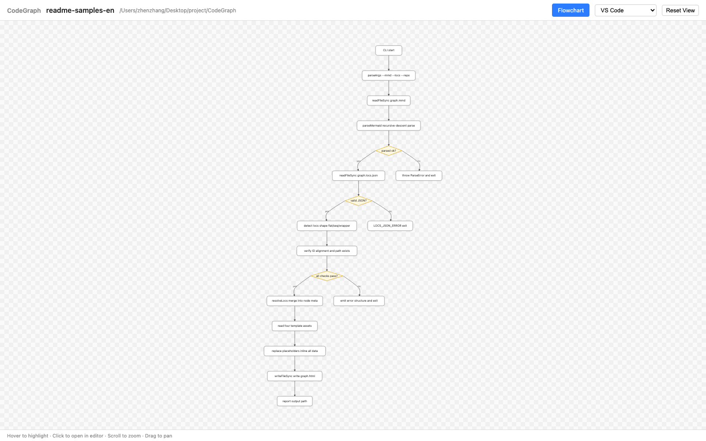
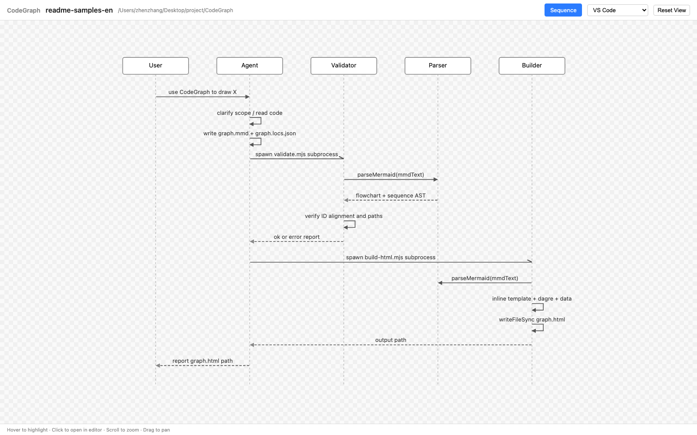

# CodeGraph

[English](README.md) · [中文](README.zh-CN.md)

> Generate interactive, single-page flowchart and sequence-diagram HTML from any codebase, with click-to-jump-to-source in your editor. An AI agent reads your code and produces the graph; this repo provides the skill, validator, and HTML builder.

## What it does

Turn a request like *"use CodeGraph to draw the login flow as a flowchart"* into a self-contained `graph.html` you can open in any browser:

- The agent reads your repo and produces two artifacts:
  - `graph.mmd` — topology in a strict Mermaid subset.
  - `graph.locs.json` — flat `[file, line]` lookup per node.
- A validator checks syntax, ID alignment, and path existence.
- A builder inlines everything (vendored dagre + renderer + your data) into one HTML file with zoom / pan / hover / click-to-jump.

The HTML has **zero runtime dependencies** — no server, no CDN, no `npm install` on the viewer's machine.

### Example output

**Flowchart** (zoom / pan / hover / click any node to jump to its source line):



**Sequence diagram** (sync / return / async arrows, hover the line or the label):



## Install

### Requirements

- **Node.js 18+** (uses native `node:*` ESM imports; no `npm install` needed at runtime — all dependencies are vendored).
- A supported editor for click-to-jump (see below).
- An AI agent that supports skills (e.g. Claude Code), or run the scripts manually.

### Add to Claude Code

Clone the repo, then symlink (or copy) the skill into your Claude skills directory:

```bash
git clone https://github.com/longbowzz/CodeGraph.git
ln -s "$(pwd)/CodeGraph/skill/CodeGraph" ~/.claude/skills/CodeGraph
```

Or copy the `skill/CodeGraph/` directory into a project-local `.claude/skills/CodeGraph/`.

### Verify

```bash
node CodeGraph/skill/CodeGraph/scripts/_smoke-parser.mjs
node CodeGraph/skill/CodeGraph/scripts/_smoke-validate.mjs
```

Both should report all-pass.

## Usage

### Via Claude Code skill (recommended)

In any repo you want to analyze, just say:

> Use the CodeGraph skill to draw the X flow as a flowchart / sequence diagram.

The agent will:

1. Ask you to pick an editor the first time (writes `.codegraph/config.json`).
2. Clarify scope with you (≤ 3 rounds).
3. Read your code and produce `graph.mmd` + `graph.locs.json`.
4. Validate, retry on errors, build the HTML.
5. Report the output path.

### Manual

```bash
node skill/CodeGraph/scripts/validate.mjs \
  --mmd path/to/graph.mmd \
  --locs path/to/graph.locs.json \
  --repo /path/to/your/repo

node skill/CodeGraph/scripts/build-html.mjs \
  --mmd path/to/graph.mmd \
  --locs path/to/graph.locs.json \
  --repo /path/to/your/repo \
  --out path/to/graph.html \
  --editor-config /path/to/your/repo/.codegraph/config.json
```

## Output structure

```
<repo>/.codegraph/
├── config.json                              # editor choice (auto-generated)
└── output/
    └── <YYYYMMDD-HHMM>-<topic-slug>/
        ├── graph.mmd                        # topology
        ├── graph.locs.json                  # file:line lookup
        └── graph.html                       # final single-page output
```

Each invocation produces a new timestamped subdirectory — history is preserved, never overwritten.

## Supported editors

Click-to-jump uses OS-level URL schemes (no helper app required).

| Editor | URL scheme | macOS out-of-box |
|---|---|---|
| VS Code | `vscode://file...` | ✅ |
| VS Code Insiders | `vscode-insiders://file...` | ✅ |
| Cursor | `cursor://file...` | ✅ |
| IntelliJ IDEA | `idea://open?...` | ✅ |
| PyCharm | `pycharm://open?...` | ✅ |
| WebStorm | `webstorm://open?...` | ✅ |
| GoLand / PhpStorm / Rider / CLion / RubyMine | `<product>://open?...` | ✅ |
| **Web (in-browser)** | — | ✅ |

The **Web** editor doesn't launch an external app. Instead, the builder embeds
every source file referenced by the graph into the HTML at build time, and
clicking a node opens the source in a right-side code panel inside the same
browser tab — syntax-highlighted and scrolled to the target line. A draggable
splitter divides the canvas from the code (default canvas:code = 1:2; double-click
the splitter to reset). Use this when no supported editor is installed locally.


**Not supported** (no native URL scheme): Sublime, Zed, Neovim, Vim, Trae.

> Safari shows a confirmation prompt on every click. Chrome / Firefox / Edge ask once and remember. Recommend Chrome for frictionless jumping.

## Project layout

```
CodeGraph/
├── skill/CodeGraph/
│   ├── SKILL.md                  # Agent instructions
│   ├── scripts/
│   │   ├── mermaid-parser.mjs    # Strict Mermaid subset parser
│   │   ├── validate.mjs          # Schema + ID + path validator
│   │   ├── build-html.mjs        # Single-page HTML builder
│   │   ├── _smoke-parser.mjs     # Parser tests
│   │   └── _smoke-validate.mjs   # Validator tests
│   ├── template/
│   │   ├── page.html
│   │   ├── render.js             # SVG renderer + zoom/pan + click handler
│   │   └── styles.css
│   └── vendor/
│       ├── dagre.min.js          # Bundled @dagrejs/dagre + graphlib
│       └── highlight.min.js      # Bundled highlight.js (web editor only)
├── images/                       # README screenshots
├── LICENSE
└── README.md
```

## Contributing

Issues and PRs welcome. Please run the smoke tests before submitting:

```bash
node skill/CodeGraph/scripts/_smoke-parser.mjs
node skill/CodeGraph/scripts/_smoke-validate.mjs
```

For browser-level changes, also run:

```bash
python3 skill/CodeGraph/scripts/_browser-test.py path/to/graph.html
```

## License

[MIT](LICENSE).
