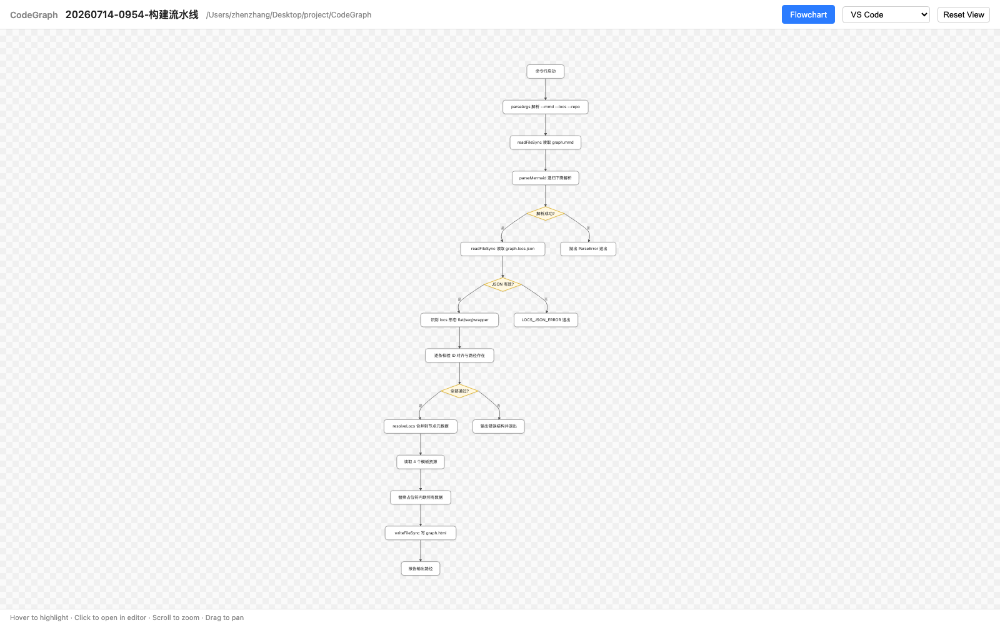
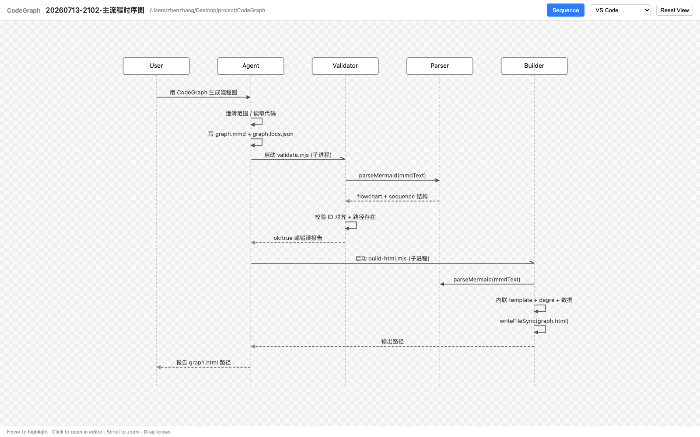
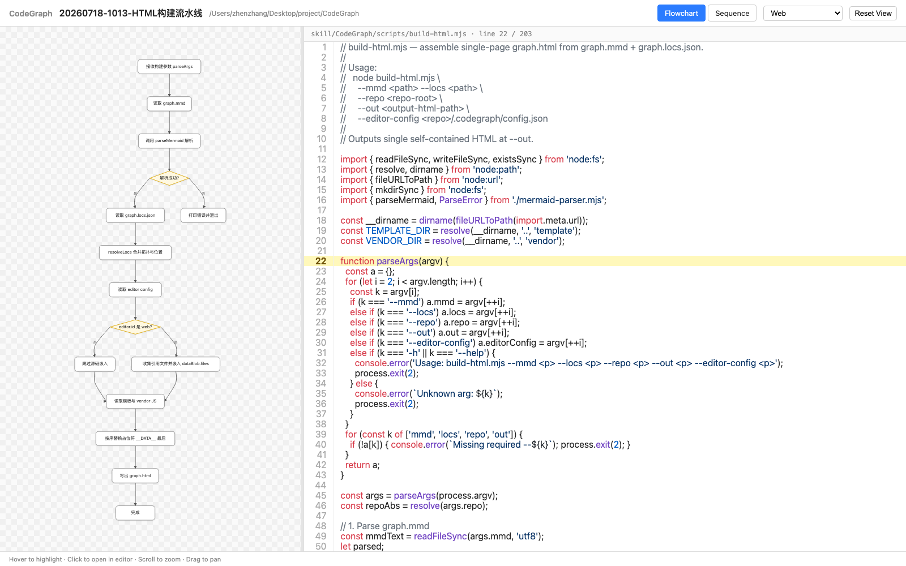

# CodeGraph

[English](README.md) · [中文](README.zh-CN.md)

> 用 AI Agent 阅读你的代码，生成交互式单页流程图 / 时序图 HTML，点击节点直接跳转到编辑器对应代码位置。本仓库提供 Skill、校验器和 HTML 构建器。

## 它能做什么

把一句 *"用 CodeGraph 画一下登录流程的流程图"* 变成一个自包含的 `graph.html`，任何浏览器都能打开：

- Agent 读取你的仓库，产出两个文件：
  - `graph.mmd` — 严格 Mermaid 子集描述的拓扑。
  - `graph.locs.json` — 每个节点的 `[file, line]` 查表。
- 校验器检查语法、ID 对齐、路径是否存在。
- 构建器把所有资源（dagre + 渲染器 + 你的数据）内联到一个 HTML 文件里，自带缩放 / 平移 / hover / 点击跳转。

**评审模式**：向 Agent 提供 PR、commit 或 `base..head` 范围，它会用绿 / 橙 / 红高亮新增、修改、删除的节点与边，让评审者一眼看清改动在整体流程中的位置。

生成的 HTML **零运行时依赖** —— 不需要服务器、CDN，查看方无需 `npm install`。

### 示例输出

**流程图**（缩放 / 平移 / hover / 点击任意节点跳转到对应源码行）：



**时序图**（支持同步 / 返回 / 异步三种箭头，hover 线条或文字均可）：



## 安装

### 环境要求

- **Node.js 18+**（运行时只用 `node:*` 内置 ESM，无需 `npm install`，依赖全部 vendored）。
- 一个支持 URL scheme 的编辑器（见下表）。
- 支持 Skill 的 AI Agent（如 Claude Code），或手动运行脚本。

### 添加到 Claude Code

克隆仓库后，把 Skill 软链或复制到 Claude 的 skills 目录：

```bash
git clone https://github.com/longbowzz/CodeGraph.git
ln -s "$(pwd)/CodeGraph/skill/CodeGraph" ~/.claude/skills/CodeGraph
```

或把 `skill/CodeGraph/` 目录复制到目标项目的 `.claude/skills/CodeGraph/`。

### 验证

```bash
node CodeGraph/skill/CodeGraph/scripts/_smoke-parser.mjs
node CodeGraph/skill/CodeGraph/scripts/_smoke-validate.mjs
```

两个都应该全部通过。

## 使用

### 通过 Claude Code Skill（推荐）

在任意你想分析的项目里，直接说：

> 用 CodeGraph 技能生成 X 流程的流程图 / 时序图

Agent 会：

1. 首次让你选择编辑器（写入 `.codegraph/config.json`）。
2. 和你对齐范围（最多 3 轮）。
3. 读取代码，产出 `graph.mmd` + `graph.locs.json`。
4. 校验，失败重试，构建 HTML。
5. 报告输出路径。

### 手动

```bash
node skill/CodeGraph/scripts/validate.mjs \
  --mmd path/to/graph.mmd \
  --locs path/to/graph.locs.json \
  --repo /path/to/your/repo

node skill/CodeGraph/scripts/build-html.mjs \
  --mmd path/to/graph.mmd \
  --locs path/to/graph.locs.json \
  --repo /path/to/your/repo \
  --out path/to/graph.html \
  --editor-config /path/to/your/repo/.codegraph/config.json
```

## 输出结构

```
<repo>/.codegraph/
├── config.json                              # 编辑器选择（自动生成）
└── output/
    └── <YYYYMMDD-HHMM>-<topic-slug>/
        ├── graph.mmd                        # 拓扑
        ├── graph.locs.json                  # file:line 查表
        └── graph.html                       # 最终单页输出
```

每次调用都会产生一个新的时间戳子目录 —— 历史保留，不会覆盖。

## 支持的编辑器

点击跳转通过 OS 级 URL scheme 实现（不需要辅助 App）。

| 编辑器 | URL scheme | macOS 开箱即用 |
|---|---|---|
| VS Code | `vscode://file...` | ✅ |
| VS Code Insiders | `vscode-insiders://file...` | ✅ |
| Cursor | `cursor://file...` | ✅ |
| IntelliJ IDEA | `idea://open?...` | ✅ |
| PyCharm | `pycharm://open?...` | ✅ |
| WebStorm | `webstorm://open?...` | ✅ |
| GoLand / PhpStorm / Rider / CLion / RubyMine | `<product>://open?...` | ✅ |
| **Web（浏览器内）** | — | ✅ |

**Web** 编辑器不会启动外部应用。构建时会把图里引用到的源文件全部嵌入 HTML，点击节点时直接在同一浏览器标签页右侧的代码面板里打开源码——语法高亮、自动滚到目标行。画布与代码之间有可拖拽的分隔条（默认画布:代码 = 1:2，双击分隔条可重置）。本地没有装受支持的编辑器时推荐用这个模式。



**不支持**（没有原生 URL scheme）：Sublime、Zed、Neovim、Vim、Trae。

> Safari 每次点击都会弹确认框；Chrome / Firefox / Edge 只问一次并记住。推荐用 Chrome 获得最顺滑的跳转体验。

## 项目结构

```
CodeGraph/
├── skill/CodeGraph/
│   ├── SKILL.md                  # Agent 指令文档
│   ├── scripts/
│   │   ├── mermaid-parser.mjs    # 严格 Mermaid 子集解析器
│   │   ├── validate.mjs          # schema + ID + 路径校验器
│   │   ├── build-html.mjs        # 单页 HTML 构建器
│   │   ├── _smoke-parser.mjs     # 解析器测试
│   │   └── _smoke-validate.mjs   # 校验器测试
│   ├── template/
│   │   ├── page.html
│   │   ├── render.js             # SVG 渲染 + 缩放/平移 + 点击处理
│   │   └── styles.css
│   └── vendor/
│       ├── dagre.min.js          # 打包的 @dagrejs/dagre + graphlib
│       └── highlight.min.js      # 打包的 highlight.js（仅 web 编辑器用）
├── images/                       # README 截图
├── LICENSE
└── README.md
```

## 贡献

欢迎提 Issue 和 PR。提交前请先跑冒烟测试：

```bash
node skill/CodeGraph/scripts/_smoke-parser.mjs
node skill/CodeGraph/scripts/_smoke-validate.mjs
```

涉及浏览器层面的改动，额外运行：

```bash
python3 skill/CodeGraph/scripts/_browser-test.py path/to/graph.html
```

## 协议

[MIT](LICENSE)。
