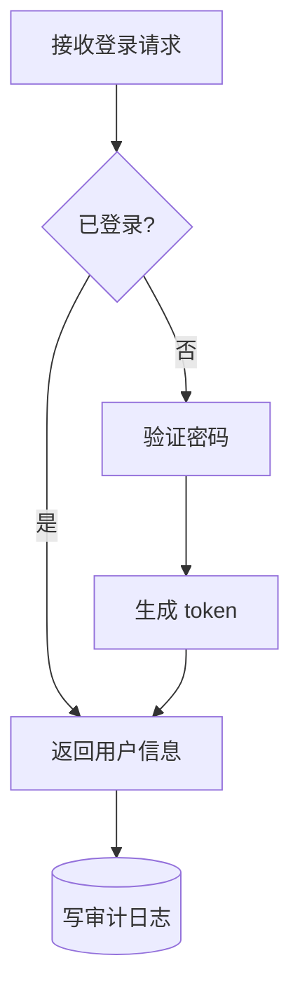
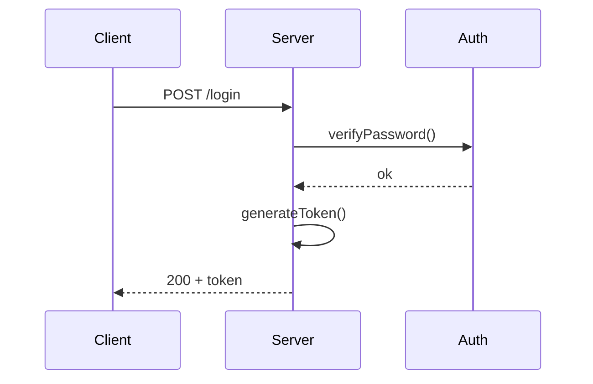

# CodeGraph 技术设计文档

> 配套 `docs/PRD.md`。本文档基于第一性原理推导技术选型，列出关键假设、验证步骤、备选方案与回退路径。

---

## 0. 设计原则

1. **简单优先**：v1 只做 PRD 必需特性，每条技术决策都要能追溯回 PRD 某一条。
2. **零外部依赖（运行时）**：最终 HTML 必须单文件、无网络、无后台。
3. **顺应 LLM 的训练分布**：让 LLM 用它最熟悉的格式表达最关键的部分（拓扑），其他信息走查表。
4. **可演进**：v1 的产物结构保留扩展空间，但实现不过度抽象。

---

## 1. 第一性原理分解

| # | 原子问题 | 关键张力 |
|---|---|---|
| Q1 | 用什么**数据格式**承载 CodeGraph？ | LLM 训练过 Mermaid，没训练过自定义 JSON；但节点要带 file:line |
| Q2 | **解析**该格式成结构化模型 | 复用 Mermaid 解析器（不稳定）vs 自己写（受限子集） |
| Q3 | **布局**：把节点摆到画布坐标上 | 流程图（有向图）布局 vs 时序图布局 |
| Q4 | **渲染**：画布交互（hover/click/zoom/pan） | SVG vs Canvas |
| Q5 | **代码跳转**：浏览器 → 本地 IDE + 行号 | 浏览器无法执行 CLI，只能靠 URL scheme |
| Q6 | **校验** + **HTML 生成**：构建管线 | 校验器选型；模板嵌入策略 |

---

## 2. Q1 — 数据格式

### 2.1 核心洞察

PRD 第 8 行说"例如 Mermaid 格式？"——"例如"意味着 Mermaid 只是候选形状，不是硬约束。但**LLM 训练分布**才是决定性因素：

- **Mermaid 文本**：GitHub README、文档、博客海量出现，LLM 训练充分，能稳定、紧凑、正确地产出拓扑。
- **自定义 JSON**：LLM 能写，但每多一个字段就稀释一次注意力，模型要花预算维护 `kind`/`meta`/`createdAt` 这种非拓扑字段，而不是专注图的本身。

**结论：拓扑用 Mermaid（LLM 强项），位置信息走查表（极简 sidecar JSON）。** 两者职责分离，互不污染。

### 2.2 决策：**Mermaid 文本 + `.locs.json` sidecar**

- **`graph.mmd`**：标准 Mermaid 子集（详见 §2.4），承载拓扑。
- **`graph.locs.json`**：扁平 id → `[file, line]` 查表，承载位置。
- 两个文件由 Agent **同一次产出**，validator 强制 ID 集合对齐。

### 2.3 范例

**流程图 `graph.mmd`**：



**`graph.locs.json`**：

```json
{
  "A": ["src/handler.ts", 12],
  "B": ["src/handler.ts", 20],
  "C": ["src/handler.ts", 35],
  "D": ["src/auth.ts", 8],
  "E": ["src/auth.ts", 45],
  "F": ["src/audit.ts", 4]
}
```

**时序图 `graph.mmd`**：



**`graph.locs.json`**（时序图：actor 用 id 索引；message 按出现顺序）：

```json
{
  "actors": {
    "C": ["src/client.ts", 1],
    "S": ["src/server.ts", 30],
    "A": ["src/auth.ts", 1]
  },
  "messages": [
    ["src/server.ts", 35],
    ["src/auth.ts", 12],
    ["src/auth.ts", 25],
    ["src/server.ts", 48],
    ["src/server.ts", 50]
  ]
}
```

### 2.4 Mermaid 子集契约

为了让 §3 的解析器简单、稳定，SKILL.md 严格规定 LLM 只能用以下子集。**任何超出此子集的语法都会被 validator 拒绝**，强制 Agent 修正。

**Flowchart 子集**：
- 头部：`flowchart TD` 或 `flowchart LR`
- 节点形态（仅这 4 种）：
  - `A[文本]`（普通节点）
  - `A{文本}`（判定/分支）
  - `A([文本])`（起止）
  - `A[(文本)]`（存储/外部）
- 边形态（仅这 4 种）：
  - `A --> B`
  - `A -->|文本| B`
  - `A -.-> B`（虚线，用于异步/返回）
  - `A -.->|文本| B`
- 节点 id 必须是 `[A-Za-z][A-Za-z0-9_]*`，且**唯一**。
- 文本中避免 `]`、`}`、`|` 字符；如需包含，先转义。

**Sequence 子集**：
- 头部：`sequenceDiagram`
- 参与者：`participant <id> as <displayName>`（displayName 必填）
- 消息箭头（仅这 4 种）：
  - `A->>B: 文本`（同步）
  - `A-->>B: 文本`（返回）
  - `A-)B: 文本`（异步）
  - `A->>A: 文本`（自调用）
- 注释：`Note left of A: 文本` / `Note right of A: 文本` / `Note over A: 文本`
- 控制块（可选）：`loop 描述 ... end` / `alt 条件 ... else ... end` / `opt 条件 ... end`
- 不使用 `activate`/`deactivate`/`autonumber`/`box`/`rect`/`links`/`link` 等高级特性（v1 不需要）。

> 这套契约刻意小。未来若需要更多形态，扩展子集 + 同步更新解析器即可。

### 2.5 关键假设 / 验证

- H1：Mermaid 子集对 LLM 友好，产出稳定。→ 验证：让 Agent 在 3 个不同代码库各跑一次，看产出是否始终落在子集内。
- H2：双文件 ID 同步在 Agent 单次产出下可靠。→ 验证：validator 强制对齐，统计重试次数。
- H3：子集覆盖 v1 实际流程图/时序图需求。→ 验证：在 5 个真实样本上看是否够用。

---

## 3. Q2 — 解析（自写极简 Mermaid 解析器）

### 3.1 候选

| 方案 | 评估 |
|---|---|
| 用 `@mermaid-js/parser` | pre-2.0、AST 形状无稳定契约；Langium 迁移尚未完成；解析我们不需要的高级特性反而引入复杂 |
| 用 Mermaid 自带的 `mermaid.parse` | 只返回 bool 或抛错，不返回 AST |
| **自写解析器**（仅处理 §2.4 子集） | ~150 行递归下降；完全可控；validator 能拒绝越界语法 |

### 3.2 决策：自写极简解析器

理由：子集小、契约清晰；手写解析器同时承担"解析"+"语法校验"两个职责，零额外依赖。

### 3.3 解析器接口（伪代码）

```js
// 输入：Mermaid 文本
// 输出：{ kind: 'flowchart' | 'sequence', ... } 或抛错（带行号 + 错误描述）
parseMermaid(text) -> {
  flowchart?: { nodes: [{id, label, shape}], edges: [{from, to, style, label?}] },
  sequence?: { actors: [{id, name}], messages: [{from, to, style, text}], notes: [...], blocks: [...] }
}
```

解析器同时记录每个元素的**源文件行号**（错误反馈用，不是节点 location）。

---

## 4. Q3 — 布局

### 4.1 流程图布局

调研结论：
- `@dagrejs/dagre`（社区维护的分叉，~14KB gzip）输出 SVG 友好坐标，是 Mermaid / React Flow 同款引擎。
- `elkjs` 强但 MB 级或需 WASM，不利于内联。
- 自己写 Sugiyama ~500 行能跑，但 v1 不划算。

**决策：内联 `@dagrejs/dagre` v2.x。** 这是唯一引入的第三方运行时依赖。

**回退路径**：若未来想零依赖，可换手写 Sugiyama——dagre 输出的坐标接口（`{x,y,width,height}` + `points`）已经是我们内部渲染契约，替换布局模块不影响渲染层。

### 4.2 时序图布局

**决策：手写。** 算法简单：
1. actors 按声明顺序均匀分布在 x 轴。
2. messages 按数组顺序自上而下排，每条占一行 y。
3. actor lifeline = 从 y(header) 到 y(maxMessage) 的竖线。
4. self-message = 折返箭头。
5. 控制块（loop/alt/opt）= 包裹一段 y 区间的外框。

预估 100–150 行 JS。无需依赖。

### 4.3 关键假设 / 验证

- H4：dagre 默认参数足够美观。→ 验证：在节点数 5 / 20 / 50 三档样本上看渲染效果，必要时调参。
- H5：手写时序图布局能正确处理 self-message + 嵌套控制块。→ 验证：构造 1 个含这两种结构的样本。

---

## 5. Q4 — 渲染（画布交互）

### 5.1 SVG vs Canvas

| 维度 | SVG | Canvas |
|---|---|---|
| Per-element 事件 | 原生 DOM 事件 + CSS `:hover` | 需自己写 hit testing |
| Zoom & pan | `<g transform>` 一行 | 需全量重绘 |
| 文字缩放清晰度 | 无极（矢量） | 位图易糊 |
| 100 节点以内性能 | 完全够用 | 大材小用 |

**决策：SVG。** PRD 要求 hover 高亮 + 点击跳转 per 元素，SVG 把这部分省到 0 成本。

### 5.2 Zoom & Pan

**决策：手写 ~30 行。** `<g transform="translate scale">` 包裹所有图形，监听 `wheel` + `pointerdown/move/up`。

不引入 `svg-pan-zoom` / `d3-zoom`：30 行代码可解决，符合 CLAUDE.md "Simplicity First"。

### 5.3 渲染契约

- 节点 = `<g class="cg-node" data-id="A">`，内含 `<rect>` + `<text>`。
- 边 = `<path class="cg-edge" data-from="A" data-to="B">`。
- 时序图 message = `<path class="cg-msg" data-idx="0">`，actor = `<g class="cg-actor" data-id="C">`。
- 事件代理在 SVG 根节点统一处理 hover/click，避免给每个元素挂监听。
- click → 反查 `locs` → 拼接 URL scheme → `window.location = url`。

### 5.4 关键假设 / 验证

- H6：节点 ≤ 100 时 SVG 性能无压力。→ 验证：100 节点样本下 Chrome 帧率。
- H7：事件代理足以扩展。→ 验证：100 节点下内存与响应延迟。

---

## 6. Q5 — 代码跳转（IDE 集成）

### 6.1 物理约束

浏览器无法执行 CLI。**唯一路径是 OS 注册的 URL scheme**。

| 编辑器 | URL scheme | 浏览器开箱可用？ | 范例 |
|---|---|---|---|
| VS Code | `vscode://file/{path}:{line}:{col}` | ✅ | `vscode://file/Users/foo/a.ts:42:5` |
| VS Code Insiders | `vscode-insiders://file/...` | ✅ | 同上 |
| Cursor | `cursor://file/{path}:{line}:{col}` | ✅ | 同上（`file/` 段必填） |
| JetBrains 系 | `<product>://open?file={path}&line={N}` | ✅ | `idea://open?file=/a.ts&line=42` |
| Sublime/Zed/Trae/Neovim | 无原生 scheme | ❌ | v1 不支持 |

**浏览器 UX 警告**：
- Safari **每次点击**都弹确认框，无"始终允许"。
- Chrome/Firefox/Edge 第一次询问，勾"始终允许"后无声跳转。
- JS 无法可靠探测 scheme 是否注册，只能盲跳 + 失败静默。

### 6.2 决策

**v1：Tier-1 编辑器**（VS Code / VS Code Insiders / Cursor / JetBrains 系）通过内置 URL scheme 支持。HTML UI 顶部提供编辑器选择下拉，选择结果存 `localStorage`。

**v1 不支持**：Sublime / Zed / Neovim / Trae。

### 6.3 Safari Banner（决策：加）

- 在 HTML 顶部加一行 `<div class="cg-safari-warn">`，CSS `@supports` + UA 嗅探只在 Safari 显示。
- 文案："建议用 Chrome / Edge / Firefox 打开以获得静默跳转体验。"
- 成本 ~5 行，UX 收益明确。

### 6.4 配置存储

- 路径：`<repo>/.codegraph/config.json`

```jsonc
{
  "editor": {
    "id": "vscode",
    "label": "VS Code"
  },
  "outputDir": ".codegraph/output"
}
```

- 校验：编辑器 id 必须在白名单内（`vscode|vscode-insiders|cursor|idea|pycharm|webstorm|goland|phpstorm|rider|clion|rubymine`）。
- "是否本机已安装"在浏览器端无法校验；SKILL.md 引导 Agent 在用户首次配置时跑 `which code` / `ls /Applications` 做 sanity check。

### 6.5 URL 生成

`absPath = repo + '/' + location.file`，按各编辑器格式拼装，路径段 URL-encode（保留 `/`）。列号可省。

### 6.6 关键假设 / 验证

- H8：浏览器 → URL scheme → IDE 跳转链路在 macOS Chrome 上稳定。→ **v1 之前在真实 macOS Chrome 上手测 VS Code / Cursor / 某个 JetBrains IDE 各一次。**

---

## 7. 项目结构

```
CodeGraph/
├── CLAUDE.md
├── docs/
│   ├── PRD.md
│   └── TECH_DESIGN.md          ← 本文件
├── skill/                      ← Claude Code 技能目录
│   └── CodeGraph/
│       ├── SKILL.md            ← Agent 指引（英文撰写）
│       ├── scripts/
│       │   ├── mermaid-parser.mjs   ← 自写 Mermaid 子集解析器
│       │   ├── validate.mjs         ← Node 校验脚本
│       │   └── build-html.mjs       ← 生成单 HTML
│       ├── vendor/
│       │   └── dagre.min.js         ← 预下载的 @dagrejs/dagre 精简包
│       └── template/
│           ├── page.html            ← HTML 骨架
│           ├── render.js            ← SVG 渲染 + zoom/pan + 事件代理
│           └── styles.css           ← 主题样式
└── .codegraph/                ← 项目内运行时目录（gitignore）
    ├── config.json
    └── output/
        └── 20260704-1000-登录流程/
            ├── graph.mmd            ← Mermaid 拓扑
            ├── graph.locs.json      ← 位置查表
            └── graph.html           ← 单页可交互 HTML
```

**目录命名规则**：`<YYYYMMDD-HHMM>-<topic-slug>/`，每次调用技能一个独立子目录。`<topic-slug>` 由 Agent 从用户描述生成。

---

## 8. SKILL.md 设计要点

**全文用英文撰写**（LLM 对英文 instruction 遵从度更高）；但**生成的 graph 节点 label / message 文本使用用户语言**（由 Agent 在交互时确认）。

### 8.1 触发关键词（v1 严格）

- "用 CodeGraph 技能" / "use the CodeGraph skill"
- 或包含 "CodeGraph" + "流程图 / 时序图 / flowchart / sequence diagram"

### 8.2 交互流程

1. 读 `.codegraph/config.json`；若无 → 问用户选 IDE，跑 `which` / `ls /Applications` 校验存在，写入配置。
2. 与用户对齐：流程范围、深度、粒度、图类型（flowchart / sequence / both）。
3. 启发式展开 ≤ 2 层，总轮数 ≤ 3。
4. Agent 读相关代码，**手工**产出 `graph.mmd` + `graph.locs.json`。
5. 跑 `validate.mjs`；若失败，把错误反馈（含 `fix_hint`）喂回 Agent 自修复，最多 3 轮；仍失败则汇报用户。
6. 跑 `build-html.mjs` 生成 `graph.html`。
7. 把输出目录路径汇报用户，并提示"建议用 Chrome 打开"。

### 8.3 SKILL.md 必须包含的内容

为最大化 Agent 输出稳定性，SKILL.md 包含以下硬约束 + 示例：

1. **Mermaid 子集契约**（直接抄录 §2.4 全文）。
2. **3 个完整范例**（覆盖 flowchart / sequence / 混合），每个都给出 `graph.mmd` + `graph.locs.json` 配对样本。
3. **强制规则**：
   - 不许写脚本 grep/AST 提取调用关系；拓扑由 Agent 阅码决定。
   - `graph.locs.json` 的 path 必须是相对 repo 根的路径。
   - `graph.locs.json` 的 key 集合必须与 `graph.mmd` 中出现的 id 集合完全一致。
   - 每个节点/actor/message 必须有对应位置（message 按 1-based 出现顺序索引到 messages 数组）。
   - 节点 label 使用用户语言；不要用纯英文 placeholder。
4. **常见错误清单**（教 Agent 避坑）：
   - 用了 `activate`/`deactivate`/`autonumber`/`box` 等不支持特性。
   - 节点 id 含 `-` 或数字开头。
   - 文本里含未转义的 `]`、`}`、`|`。
   - 时序图 message 数量与 locs.messages 数量不一致。
   - 流程图节点 id 在 locs 里缺失。
5. **失败处理**：明确告诉 Agent 当 validator 报错时怎么读 `fix_hint` 修复，最多 3 轮后停止并汇报用户。

### 8.4 语言策略

- SKILL.md 指令、Mermaid 子集契约、错误信息：**英文**。
- 节点 label、message text、Note text、topic slug：**用户语言**（Agent 在对齐环节确认）。
- validator 输出错误信息：英文（喂回 Agent）。

---

## 9. 校验脚本（`scripts/validate.mjs`）

**输入**：`graph.mmd` 路径 + `graph.locs.json` 路径 + `--repo <root>`。
**输出**：成功 → exit 0；失败 → 非零 + JSON 错误列表。

校验层次：
1. **Mermaid 子集语法**：调用 `mermaid-parser.mjs`，任何越界语法 → 报错（带行号）。
2. **locs.json 语法 + Schema**：`JSON.parse` + 结构校验（数组长度 2，path 字符串，line 正整数）。
3. **ID 对齐**（关键）：
   - 流程图：`graph.mmd` 中所有 node id 必须出现在 `locs.json` 的顶层 key；反向亦然（无悬空 loc）。
   - 时序图：`graph.mmd` 中所有 actor id 必须出现在 `locs.actors`；message 数量必须等于 `locs.messages` 数组长度。
4. **路径真实性**：每个 loc 的 file 在 `repo` 下 `fs.existsSync`，立即拒绝臆造路径。

错误报告格式：

```json
{
  "ok": false,
  "errors": [
    {
      "level": "error",
      "code": "UNKNOWN_NODE_ID",
      "path": "graph.mmd:3",
      "message": "node id 'X' has no entry in graph.locs.json",
      "fix_hint": "Add an entry \"X\": [\"<relative/path>\", <line>] to graph.locs.json"
    }
  ]
}
```

`fix_hint` 字段是给 Agent 的修复指令，必须具体、可操作。

---

## 10. HTML 生成脚本（`scripts/build-html.mjs`）

**输入**：`graph.mmd` + `graph.locs.json` + `--repo <root>` + `--editor-config <path>`。
**输出**：单文件 `graph.html`。

构建步骤：
1. `parseMermaid(graph.mmd)` 得到结构化模型。
2. 合并 `graph.locs.json` 进每个元素的 `location` 字段。
3. 序列化整个模型为 JSON，塞进 HTML 的 `<script id="cg-data" type="application/json">`。
4. 内联 `vendor/dagre.min.js` + `template/render.js` 进 `<script>`。
5. 内联 `template/styles.css` 进 `<style>`。
6. 内联 `template/page.html` 骨架。
7. 写出 `graph.html`。

**前端 `render.js` 逻辑**：
1. `JSON.parse(document.getElementById('cg-data').textContent)`。
2. URL hash 决定初始 tab（`#flowchart` / `#sequence`）。
3. 顶部 tab 切换；只有一个图时隐藏 tab bar。
4. 顶部编辑器下拉，默认读 `localStorage.editor`。
5. 流程图：`dagre.layout(...)` → SVG。
6. 时序图：手写布局 → SVG。
7. SVG 根监听 `mouseover/mouseout/click`，事件代理靠 `event.target.closest('[data-id],[data-idx]')`。
8. click → 反查 location → 拼编辑器 URL → `window.location.href = url`。
9. zoom/pan：wheel + pointer drag 调整 `<g transform>`。
10. Safari banner：UA 嗅探显示。

---

## 11. 端到端工作流（自检视角）

| 步骤 | 行为 | 成功判据 |
|---|---|---|
| 1 | 用户："用 CodeGraph 技能生成 X 的流程图" | SKILL.md 匹配触发 |
| 2 | Agent 引导选 IDE → 写 config.json | `which` 返回 0 |
| 3 | Agent 与用户对齐范围（≤ 3 轮） | 用户确认 |
| 4 | Agent 读码 → 写 `graph.mmd` + `graph.locs.json` | 两文件存在 |
| 5 | `validate.mjs` 校验 | exit 0；否则回到 4（≤ 3 轮） |
| 6 | `build-html.mjs` 生成 HTML | `graph.html` 单文件可双击打开 |
| 7 | 用户在 Chrome 打开，切 tab，hover 高亮 | 节点变色 |
| 8 | 点击节点 | VS Code/Cursor/IDEA 打开对应文件到行 |
| 9 | wheel + drag | 平滑 zoom/pan |

---

## 12. 关键风险与缓解

| 风险 | 等级 | 缓解 |
|---|---|---|
| Agent 产出超出 Mermaid 子集 | 高 | SKILL.md 列出禁用特性；validator 立即拒绝并附 fix_hint |
| Agent 漏写某个 node 的 loc | 高 | validator 强制 ID 对齐 |
| Agent 臆造路径 | 高 | validator `fs.existsSync` 兜底 |
| 自修复循环死循环 | 中 | SKILL.md 硬约束"≤ 3 轮" |
| 时序图 message 数量与 locs 不一致 | 中 | validator 校验 |
| Safari 跳转每次弹窗 | 中 | HTML 顶部 banner 提示用 Chrome |
| dagre 内联体积（~14KB gzip） | 低 | 单 HTML 可接受 |
| Sublime/Zed/Trae 用户跳转不通 | 中 | UI 标注支持范围；v2 通过 handler app 解决 |
| 自写 Mermaid 解析器对边界情况处理不全 | 中 | 子集刻意小；解析器同时是校验器；新增越界语法会被 validator 拒绝 |

---

## 13. v1 验收清单

- [ ] Mermaid 子集契约文档化（在 SKILL.md 内）。
- [ ] `mermaid-parser.mjs` 能正确解析 §2.4 子集；对越界语法给出准确行号错误。
- [ ] `validate.mjs` 在错误输入下输出含 `fix_hint` 的错误报告。
- [ ] `build-html.mjs` 产出单 HTML，**离线**打开（断网）能渲染。
- [ ] Chrome 下点击节点 → VS Code 打开文件到行（真机手测）。
- [ ] Chrome 下点击节点 → Cursor 打开文件到行（真机手测）。
- [ ] Chrome 下点击节点 → 某个 JetBrains IDE 打开文件到行（真机手测，如已安装）。
- [ ] Safari banner 正确显示，Chrome 不显示。
- [ ] zoom/pan 在 50 节点样本下 60fps。
- [ ] 同一仓库跑两次技能，生成两个独立目录，互不覆盖。
- [ ] 在一个非 CodeGraph 的真实小项目（5–10 文件）端到端跑通。

---

## 14. v2 演进占位（仅记录，不实现）

- 自定义 `codegraph://` handler app，覆盖 Sublime/Zed/Vim/Trae。
- 节点 hover tooltip 预览代码片段。
- 节点搜索、按文件过滤。
- 扩展 Mermaid 子集（activation、autonumber、box、loop 嵌套等）。
- 手写 Sugiyama 去掉 dagre 这唯一第三方依赖。
- CodeGraph 历史索引页（PRD 已明确不做，可后期重估）。

---

## 15. 已确认的决策（不再列为开放项）

1. ✅ 数据格式 = Mermaid 文本（拓扑）+ `.locs.json`（位置查表）。
2. ✅ v1 支持 VS Code / VS Code Insiders / Cursor / JetBrains 系；不支持 Sublime/Zed/Trae/Neovim。
3. ✅ 接受 `@dagrejs/dagre` 作为唯一第三方运行时依赖（~14KB gzip，内联）。
4. ✅ 加 Safari-only banner。
5. ✅ SKILL.md 用英文；生成内容用用户语言。
